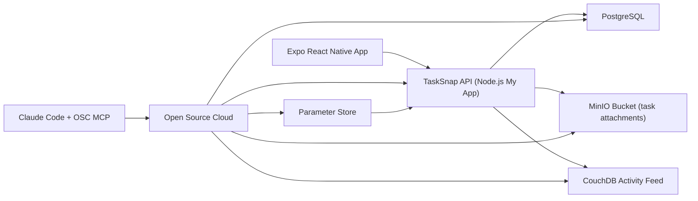

# TaskSnap Architecture

## Notes

- The mobile app talks only to the TaskSnap API.
- The API owns authentication, task/list CRUD, attachment upload, and activity mirroring.
- OSC MCP is the management layer for service provisioning, parameter-store changes, app restart, diagnostics, domain management, and service discovery.
- The app concept changed from `SpotLog` to `TaskSnap`, but the backend responsibilities still exercise the same OSC capabilities required by the assignment.
- Final live deployment is on the `Ebba` team at `https://tasklogbackend.apps.osaas.io`.
- A full reprovision and production-readiness pass was also run in `OpenEvents` to test reproducibility, backup/restore, bucket inspection, and domain behavior.
- The temporary `OpenEvents` TaskSnap deployment was removed after verification so TaskSnap is no longer deployed there.
- Current live API health on the Ebba deployment returns `200 OK` from `/health`.
